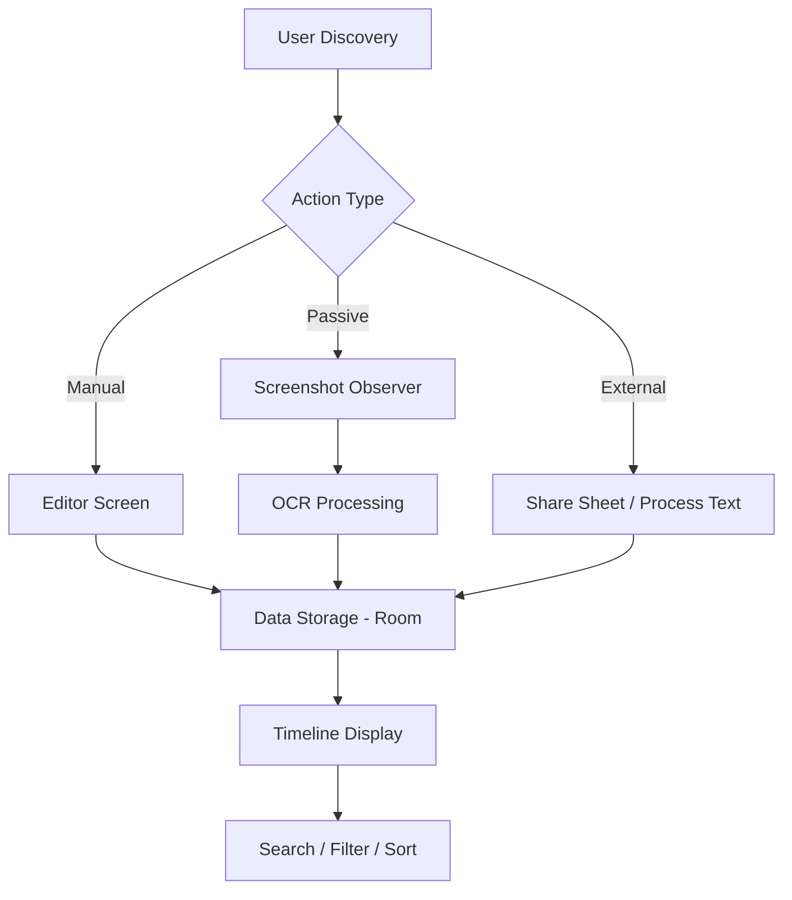
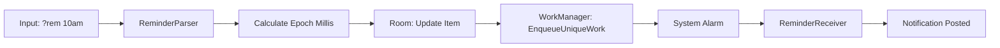
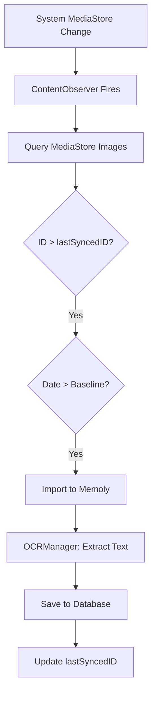

# 1. Project Overview

## Introduction
**Memoly** is a sophisticated, local-first Android application designed to serve as an intelligent "digital memory dock" for users. Unlike traditional note-taking apps, Memoly emphasizes passive and active information capture through advanced Android system integrations, including screenshot detection, cross-app sharing, and on-device text recognition (OCR). The application provides a centralized timeline where users can store, organize, and retrieve diverse content types—ranging from text notes and web links to images and documents—with an emphasis on privacy and offline reliability.

## Problem Statement
In the modern digital landscape, information is fragmented across various applications (browsers, social media, messaging, gallery). Users frequently capture screenshots or save links as reminders but often lose track of them due to a lack of a unified, searchable repository. Existing cloud-based solutions raise privacy concerns and often fail to provide seamless system-level integration, leading to a high-friction experience for quick information "parking."

## Objectives
*   To create a unified timeline for multi-modal content storage.
*   To implement low-friction information capture via Android system hooks (Share Sheet, Process Text, Quick Settings).
*   To enable intelligent search through on-device OCR for screenshots and images.
*   To provide a robust, offline-first reminder system with natural language processing capabilities.
*   To ensure high UI/UX standards using modern Jetpack Compose principles.

## Scope of the Project
The project covers the development of a full-stack Android client utilizing a local SQLite database (Room). It includes background services for media monitoring, WorkManager for notification scheduling, and Google ML Kit for computer vision tasks. The current scope is localized to the device, with architectural provisions for future cloud synchronization.

## Purpose of the Application
The primary purpose of Memoly is to act as a "second brain" that catches information at the point of discovery. Whether it is a line of text in an e-book, a screenshot of a ticket, or a shared URL, Memoly provides a "dock" where these fragments are stored, indexed, and made actionable through reminders.

## Expected Outcomes
*   A fully functional Android application with a responsive, modern UI.
*   Reliable automated screenshot syncing with OCR indexing.
*   Comprehensive search capability covering both manual notes and image text.
*   A dedicated pinned section for high-priority items.
*   Efficient resource management via background worker optimization.

## Real-World Use Cases
*   **Student Productivity**: Saving snippets from research papers via the "Process Text" menu.
*   **Task Management**: Creating checklists for groceries or project milestones with auto-continuation.
*   **Visual Bookmarking**: Taking screenshots of interesting products or travel destinations and searching for them later by text found in the image.
*   **Time-Sensitive Reminders**: Setting quick reminders for bills or meetings using the `?rem` command.

---

# 2. Module-Wise Breakdown

### 1. UI & Navigation Module
*   **Purpose**: Manages the visual interface and user transitions between app states.
*   **Responsibilities**: Rendering the timeline, note editor, and detail views; handling user interactions and theming.
*   **Main Files**: `TimelineScreen.kt`, `EditorScreen.kt`, `DetailScreen.kt`, `MemolyNavigation.kt`.
*   **Features**: Material 3 implementation, Tab-based navigation (Home, Favorites, Reminders, Notes), and interactive checklists.

### 2. Database & Data Layer Module
*   **Purpose**: Handles persistent storage and data integrity.
*   **Responsibilities**: Defining the schema, managing migrations, and providing a repository interface for UI components.
*   **Main Files**: `MemoryItem.kt`, `MemoryItemDao.kt`, `MemolyDatabase.kt`, `MemoryRepository.kt`.
*   **Features**: Room persistence, multi-criteria sorting logic, and asynchronous data flows using Kotlin Flow.

### 3. Background Automation Module
*   **Purpose**: Handles system-level events and asynchronous tasks without user intervention.
*   **Responsibilities**: Monitoring the gallery for new screenshots and scheduling notifications.
*   **Main Files**: `ScreenshotObserverService.kt`, `ReminderWorker.kt`, `BootReceiver.kt`.
*   **Features**: MediaStore `ContentObserver`, WorkManager integration, and reboot-resilient scheduling.

### 4. Intelligence & OCR Module
*   **Purpose**: Extracts structured data from unstructured media.
*   **Responsibilities**: Running text recognition on images and updating the searchable index.
*   **Main Files**: `OCRManager.kt`.
*   **Features**: Google ML Kit integration, on-device processing, and unified search indexing.

### 5. Inter-App Integration Module
*   **Purpose**: Bridges Memoly with the wider Android ecosystem.
*   **Responsibilities**: Handling shared intents, text selection actions, and quick setting tiles.
*   **Main Files**: `MemolyShareActivity.kt`, `ProcessTextActivity.kt`, `MemolyQSTileService.kt`.
*   **Features**: `ACTION_SEND` (Share Sheet), `ACTION_PROCESS_TEXT` (Text Selection), and `QS_TILE` support.

### 6. Settings & Preferences Module
*   **Purpose**: Manages user-configurable app behavior.
*   **Responsibilities**: Storing toggles for automation and sync anchors.
*   **Main Files**: `AppPreferences.kt`.
*   **Features**: Jetpack DataStore implementation and persistent "Installation Baseline" logic.

---

# 3. Functionalities

| Feature Name | Description | User Workflow | Implementation Logic | Components Used |
| :--- | :--- | :--- | :--- | :--- |
| **Intelligent Timeline** | A chronological list of all saved memories grouped by date. | User opens the app and scrolls through history. | Uses Room `Flow` to reactively update the list. Implements custom date grouping extension. | Room, Flow, Compose LazyColumn |
| **Screenshot Auto-Sync** | Automatically detects and imports system screenshots. | User takes a screenshot; a notification or item appears in Memoly. | Uses `ContentObserver` on `MediaStore`. Filters by `DATE_ADDED` > installation baseline. | MediaStore API, ContentObserver |
| **On-Device OCR** | Extracts text from images to make them searchable. | User searches for a word; screenshots containing that word appear. | Triggers `OCRManager` via ML Kit after image import. Stores text in `extractedText` column. | Google ML Kit, Coroutines |
| **Smart Checklist** | A dedicated mode for creating interactive lists. | User taps checkbox icon and types. Pressing 'Enter' adds a new line with '☐ '. | Monitors `TextFieldValue` for `\n` and auto-prefixes. Toggles '☐' to '☑' on tap. | TextFieldValue, AnnotatedString |
| **Natural Reminders** | Scheduling notifications via inline commands or picker. | User types `?rem tomorrow 9am` or uses the Date/Time picker. | `ReminderParser` regex extracts time. `WorkManager` enqueues unique work. | WorkManager, Regex, Material3 Picker |
| **Share Sheet Target** | Ability to save content from any app. | User selects "Share" on an image/link and chooses Memoly. | `MemolyShareActivity` handles `ACTION_SEND`. Copies files to internal storage. | Intent Filters, FileProvider |
| **Process Text Action** | Save text directly from the selection menu. | User highlights text in a browser and taps "Save to Memoly". | `ProcessTextActivity` handles `ACTION_PROCESS_TEXT` intent. | Intent API |
| **Advanced Sorting** | Organize memories by different criteria. | User taps sort icon and selects "Recently Modified". | `TimelineViewModel` recomposes the flow using different `ORDER BY` clauses. | SQLite, ViewModel |

---

# 4. Technology Used

## Programming Languages
*   **Kotlin**: The primary language used for all logic, ViewModels, and UI components, leveraging its concise syntax and coroutine support.

## Libraries and Tools
*   **Jetpack Compose**: Used for building a modern, declarative UI. It allowed for high-performance components like the interactive timeline and custom editor.
*   **Room Database**: An abstraction over SQLite used for reliable local data persistence and structured queries.
*   **Kotlin Coroutines & Flow**: Used for asynchronous programming and reactive data streams, ensuring the UI remains responsive during DB or OCR operations.
*   **WorkManager**: Used for scheduling reminder notifications, ensuring they fire even if the app is closed or the device reboots.
*   **Google ML Kit (Text Recognition)**: Used for on-device OCR, providing privacy-focused intelligence.
*   **Coil**: An image loading library for Android backed by Kotlin Coroutines, used to render screenshots and shared images efficiently.
*   **Jetpack DataStore**: Used instead of SharedPreferences for storing app settings and sync anchors securely and asynchronously.

## Other Tools
*   **Android Studio**: The primary IDE for development and profiling.
*   **GitHub**: Used for version control and revision tracking.
*   **Gradle**: The build automation system used to manage dependencies and APK generation.
*   **ADB (Android Debug Bridge)**: Used for deploying builds and inspecting real-time logs.

---

# 5. Flow Diagram

### Overall App Workflow

### Reminder Scheduling Flow

### Screenshot Detection Flow

---

# 6. Revision Tracking on GitHub

**Repository Name Suggestion**: `Memoly-Android-Dock`

## Development Workflow
The project followed a feature-branching strategy where core modules (Data, Services, UI) were developed iteratively. Automated builds were verified using Gradle before merging into the `main` branch.

## Commit History (Chronological)
1.  `feat: initialize project with clean architecture and room persistence`
2.  `feat: implement screenshot observer service with mediastore hooks`
3.  `feat: add sharing support for images, links, and documents`
4.  `feat: implement natural language reminder parsing (?rem command)`
5.  `fix: resolve screenshot timing and persistent sync anchor logic`
6.  `feat: integrate Google ML Kit for on-device screenshot OCR`
7.  `feat: redesign editor with compact toolbar and interactive checklists`
8.  `feat: add separate pinned section and multi-criteria timeline sorting`

---

# 7. Conclusion and Future Scope

## Conclusion
The Memoly project successfully demonstrates the integration of advanced Android APIs to create a high-utility, local-first application. By combining passive capture (screenshot detection) with active intelligence (OCR), the app solves the problem of information fragmentation. Key technical achievements include the implementation of a stable, low-latency media observer, a robust reminder engine using WorkManager, and a highly interactive Compose-based editor. The project provided deep insights into system-level integrations and the nuances of on-device machine learning.

## Future Scope
*   **Semantic Search**: Moving beyond keyword matching to concept-based search using vector embeddings.
*   **Cloud Synchronization**: Implementing an encrypted MongoDB or Google Drive sync for cross-device availability.
*   **Smart Categorization**: Using AI to automatically tag items based on content (e.g., #receipt, #article, #work).
*   **Widget Support**: Providing a "Quick Glance" widget for upcoming reminders and pinned notes.
*   **Voice Capture**: Integration of speech-to-text for hands-free memory logging.

---

# 8. References
1.  Google. (2024). *Android Developers Documentation*. [https://developer.android.com/](https://developer.android.com/)
2.  Google. (2024). *Jetpack Compose Components*. [https://developer.android.com/compose](https://developer.android.com/compose)
3.  Google ML Kit. (2024). *Text Recognition API*. [https://developers.google.com/ml-kit/vision/text-recognition](https://developers.google.com/ml-kit/vision/text-recognition)
4.  Kotlin Foundation. (2024). *Coroutines and Flow Guide*. [https://kotlinlang.org/docs/coroutines-overview.html](https://kotlinlang.org/docs/coroutines-overview.html)
5.  WorkManager. (2024). *Scheduling background tasks*. [https://developer.android.com/topic/libraries/architecture/workmanager](https://developer.android.com/topic/libraries/architecture/workmanager)

---

# Appendix

## A. AI Generated Project Breakdown
The project follows a **Local-First Architecture** with a clear separation of concerns between the data, domain, and UI layers.
*   **Architecture**: MVVM (Model-View-ViewModel) with Repository pattern.
*   **Data Flow**: The `MemoryRepository` serves as the single source of truth. ViewModels observe `StateFlow` from the repository, which is backed by Room's reactive queries.
*   **Internal Logic**: The `ScreenshotObserverService` uses a "Sync Anchor" (stored in DataStore) to maintain state across app resets.
*   **Feature Interaction**: When an image is shared to `MemolyShareActivity`, it is copied to internal storage via `FileProvider` to ensure permanent access even if the source app deletes it.

## B. Problem Statement
Users frequently encounter valuable information across disparate mobile applications. The current Android user experience relies on separate siloed apps for notes, bookmarks, and gallery management. This fragmentation results in a high cognitive load for information retrieval and a significant risk of important data being forgotten or lost in the noise of a generic gallery. There is a need for a centralized, intelligent, and private "docking" system that captures this data with zero-to-low friction.

## C. Solution/Code
### Folder Structure
*   `com.memoly.dock.data`: Entities, DAOs, and Database configuration.
*   `com.memoly.dock.services`: Background services (OCR, Screenshot Observer, Tile Service).
*   `com.memoly.dock.ui`: Jetpack Compose screens, components, and ViewModels.
*   `com.memoly.dock.workers`: WorkManager implementations for reminders.
*   `com.memoly.dock.receivers`: Broadcast receivers for boot and notification actions.

### Key Components
*   **`ScreenshotObserverService`**: Utilizes a `ContentObserver` to monitor `MediaStore.Images.Media.EXTERNAL_CONTENT_URI`. It effectively filters for screenshots using filename patterns and timestamp thresholds.
*   **`EditorViewModel`**: Manages a complex `TextFieldValue` state to support inline media markers and interactive checklists.
*   **`OCRManager`**: A singleton wrapper that converts image URIs into `InputImage` objects for ML Kit processing.
